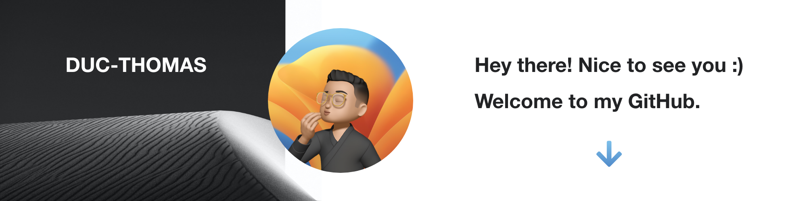

 

Bienvenue to my README.md I'm a Fullstack Developer from <b>Paris, France</b> , currently working with an amazing team at <a href="https://www.touch-sell.com/">Touch and Sell</a> .

**About me**

- 💼 FullStack Developer at @Touch & Sell
- 👨🏻‍💻 FullStack Developer and UX/UI Designer @Sepefrei
- 🎓 Software engineering student @Efrei
- 🏍️ Motorcycle and mountain bike enthusiast

My portfolio: [ducki.dev](https://ducki.dev)

|  |  |
| ------------- | ------------- |

**Recent work repositories**

|  | 
| ------------- | ------------- |

 

<h3>Things I code with</h3>

  
  
  
  
  
  
  
  
  
  
  

  

  
  

